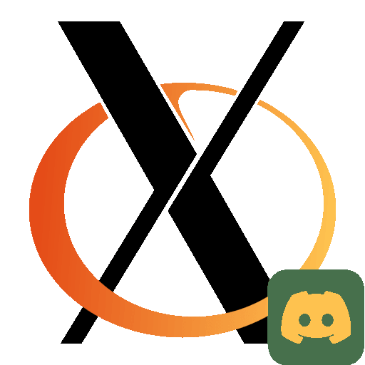
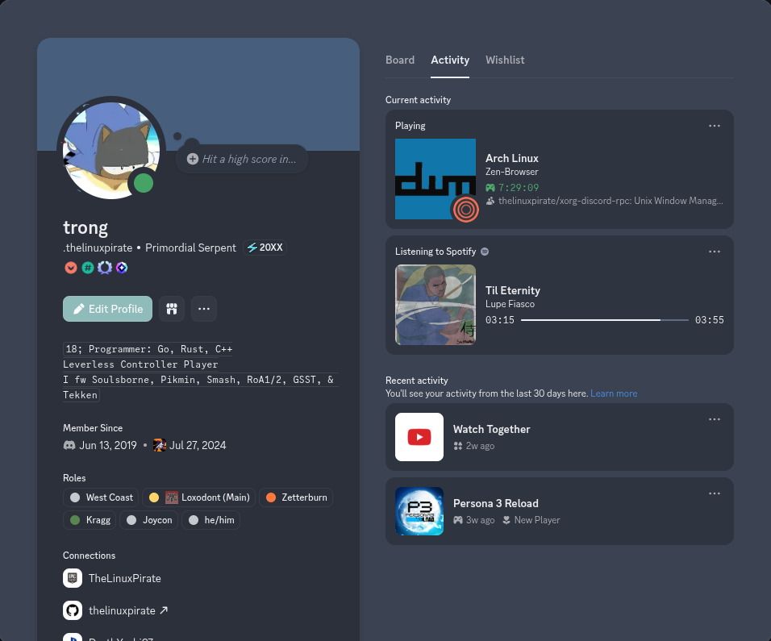

# Xorg Discord Rich Presence


<!--
 TODO: 
 ADD AUR PACKAGE TO THIS LIST
 ADD BINARY RELEASE TO REPO RELEASES
 Write CONFIGURATION.md
j-->

## Table of Contents


- [Introduction](#introduction)
- [Showcase](#showcase)
- [Installation](#installation)
- [Usage](#usage)
  - [Prerequisite](#prerequisite)
  - [How It Works](#how-it-works)
  - [Why a PID File?](#why-a-pid-file)
- [Usage (CLI)](#usage-cli)
- [License](#license)

**Other Resources**
- [Assets Information](https://github.com/thelinuxpirate/xorg-discord-rpc/blob/main/assets/README.org) | Extra information regarding your Application's assets 
- [Building Explanation](https://github.com/thelinuxpirate/xorg-discord-rpc/blob/main/discord-sdk/README.org) | For a manual installation
- [Configuration Explanation](https://github.com/thelinuxpirate/xorg-discord-rpc/blob/main/CONFIGURATION.md) | Goes over `config.toml` 

## Introduction
Discord RPC (Rich Presence) lets you show what you're doing in Discord, like which game or application is active. 
This project implements an Xorg version of Discord RPC for Linux, letting you show your currently focused application, 
window, or window's status as your Rich Presence. 

Built using Discord's 'Legacy Version' of the [Game SDK](https://discord.com/developers/docs/developer-tools/game-sdk) 
instead of the newer [Social SDK](https://discord.com/developers/docs/discord-social-sdk/overview) because the Social SDK 
focuses more on a deep social integration, player engagement, & junk to this application's purpose.
Meanwhile the Game SDK purely focuses on just providing an activity status without relying on other 'Game/Player' features. 
## Showcase

This is how your profile could appear after running the program.

- Large Image = Window Manager logo
- Small Image = Currently focused application logo
- Details = Currently focused application
- State = Currently focused application title
## Installation
If you'd like to build this program by source: [Manual Building Explanation](https://github.com/thelinuxpirate/xorg-discord-rpc/blob/main/discord-sdk/README.org)


You can download the binary on the 'Releases' page to your right.
### TODO: Arch Linux (AUR)
NOT released yet...
Packaged on Arch Linux's User Repository, use your preferred AUR helper. 
```sh
$ paru -S xorg-discord-rpc
$ yay -S xorg-discord-rpc
# or manually via Arch Linux's makepkg
$ makepkg -sci
```
## Usage
### Prerequisite
Create an application on the [Discord Developer Site](https://discordapp.com/developers/applications/me).

- Set a redirect URL. If you don't have one right now, just use <http://127.0.0.1>.
- Enable Rich Presence for the application. This enables whitelist access for the SDK.
    - When you are ready to test with more people, add them to the whitelist.
- Copy the `CLIENT ID`.
    - Use this `CLIENT_ID` when initializing the SDK.
   
Source: **Discord Game SDK - README.md**
### How It Works
`xorg-discord-rpc` runs as a lightweight background daemon that monitors the currently focused Xorg window &
updates your Discord Rich Presence accordingly.

**Discord Application**
- Create a Discord Application via the Developer Portal. 
- `xorg-discord-rpc` connects to your Application via the Application's `CLIENT_ID`.
- The application name becomes the “game/application” shown in Discord.
- Rich Presence image assets are uploaded under Art Assets & referenced by name in the configuration file.

**Daemon Initialization**
- When launched, the program initializes the Discord Game SDK using your provided `CLIENT_ID`.
- The CLI then daemonizes itself & writes a PID file to: `$XDG_RUNTIME_DIR/xorg-discord-rpc.pid`.

**Xorg Window Tracking**
- The daemon connects to the X server & monitors:
    - Window class `WM_CLASS`
    - Window title `_NET_WM_NAME`
- This information is later used in your `conifg.toml`.

**Configuration via TOML**
- Default Location: `~/.config/xorg-presence/config.toml`.
- The config has the ability to map window classes/titles to:
    - Rich Presence text
    - State messages
    - Image asset keys


For a more in-depth explanation of its usage refer to the [configuration explanation](https://github.com/thelinuxpirate/xorg-discord-rpc/blob/main/CONFIGURATION.md).
#### Why a PID file? 
Instead of relying on a SystemD service, this program uses a PID file (in `$XDG_RUNTIME_DIR`) to keep track of the running instance. 
My reasoning for this is that not every Linux distro runs the same [init system](https://en.wikipedia.org/wiki/Init), 
so using a PID file ensures the daemon works across all distros without needing special service files.
## Usage (CLI) 
xorg-discord-rpc [OPTIONS]
``` sh
# Run with your Discord APPID
$ xorg-discord-rpc -i 123456789012345678

# Load a specific config file (default: ~/.config/xorg-presence/config.toml)
$ xorg-discord-rpc -l /path/to/config.toml

# Print running daemon PID
$ xorg-discord-rpc -p 1

# Kill running daemon
$ xorg-discord-rpc -k 1
```
In a startup script.
```sh 
# Example: ~/.xinitrc or startup.sh
# No need to include '&' as it auto-runs as a daemon
xorg-discord-rpc -i 123456789012345678
exec YOUR_WM
```
These commands are useful for displaying the necessary variables/titles needed for scripting your configuration. 
```sh
$ wmctrl -lx        # Prints window IDs, classes, & titles
$ xprop -id <WINID> # Inspect a specific window's properties
$ xwininfo -id <WINID> # Get detailed information about a window
```
## License
This project’s code is licensed under the GNU General Public License v3.0 (GPL-3.0).

Exception: You are allowed to link this code with the Discord Game SDK without the combination being subject to the GPL.
This means you may distribute binaries of this project that use the Discord Game SDK without violating the GPL terms.

In other words, the GPL-3.0 applies to all of this project’s code except for the parts linking to the Discord Game SDK, which are explicitly exempted.
